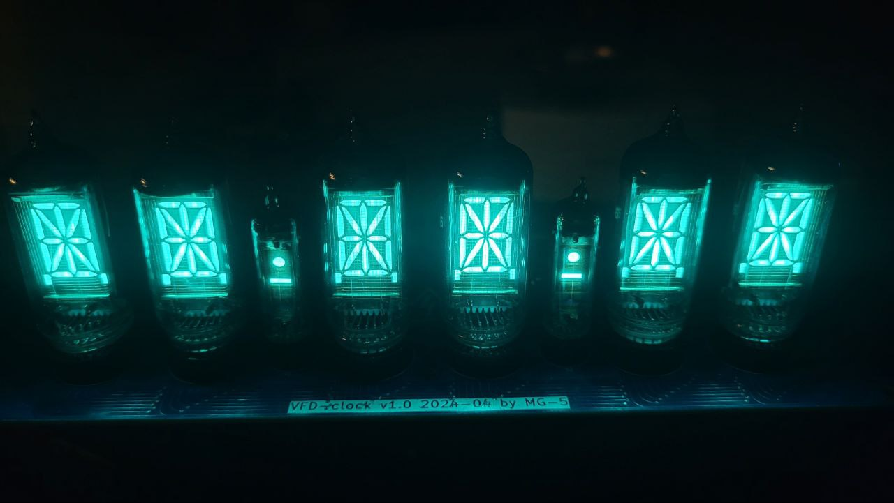

# nixie-clock-hardware
Hardware for controlling six VFD IV-17 and two VFD IV-1 tubes as clock (HH:MM:SS) 

### Requirements for rev 1.0
* efficient step-boost converter up to 50V
* multiplexing
* control syncronous addressable LEDs
* PWM control
* I²C interface
* connector for ESP (UART)
* time syncronisation line for every second

### Known issues in rev 1.0
* octal buffer for PWM use seems do not works for dimming
  * workaround: dimming solved by adding turn-off points in mulitplexing routine (firmware-based solution)
* SPI is not suitable for controlling 20-bit shift register
  * cut traces and wire up to another pins

### Pictures (rev 1.0)

